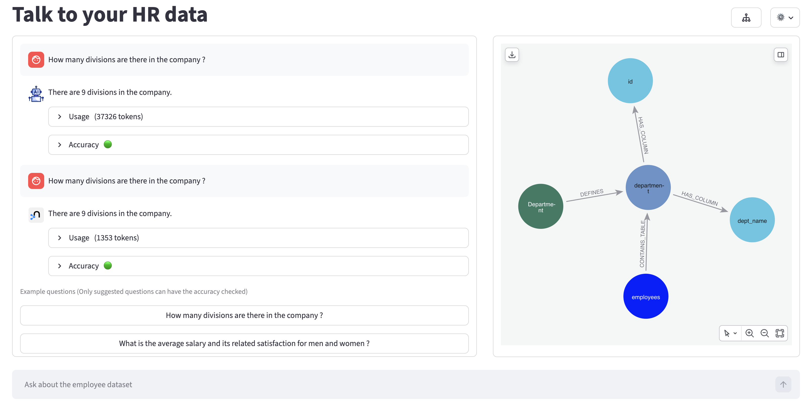

# Neo4j Semantic Layer value (Text2SQL)

## Introduction

Business users today expect to query massive datasets across platforms like Snowflake, Databricks, Azure Fabric, or BigQuery using nothing but simple, natural language. To generate accurate SQL, these agents must fully understand the underlying database structure.

The standard approach involves giving the agent a YAML or Markdown file containing all the database metadata. This creates several critical issues:
* High Token Usage: Processing the entire file for every single query drives up costs and increases response times.
* Contextual Noise: Flooding the LLM with irrelevant tables reduces accuracy and causes hallucinations, especially for complex questions.
* Static Limitations: Flat files cannot easily capture dynamic relationships or real user behavior.

A Neo4j Semantic Layer introduces a GraphRAG approach using Neo4j as a dynamic semantic layer. By moving from linear text files to a Knowledge Graph, the agent stops "reading" all the metadata and starts intelligently "navigating" your data architecture.

## Description and Goal

This project aims to explain the added value of using a semantic layer with Neo4j to do text2SQL to answer question in natural language.

The application let you ask questions using either an agent with a YAML or markdown description or an agent with neo4j to show the 2 main added values:
* Reducing the number of tokens used to answer
* Improving the accuracy of the answer, especially for complex questions.

What is stored in the Semantic Layer? To ground the LLM with surgical precision and produce valid SQL, the Neo4j semantic layer stores:
* RDBMS Structure: Schemas, Tables, Columns, and Types.
* RDBMS Constraints: Foreign Keys and Indexes.
* RDBMS Dictionary: Specific values or a few examples from the columns.
* Business Glossary: Domain-specific terms and definitions and a basic taxonomy structure
* Behavior of the users: joins from the RDBMS transaction logs which are not specified as Foreign Keys in the database.




## Installation

### Prerequisites
* Python (tested with Python 3.13)
* Database postgreSQL
* Neo4j Aura account (https://console.neo4j.io) with API key or Neo4j database
* OpenAI key (LLM used in the langchain agent with `gpt-5.4-mini model`, and to compute embeddings with `text-embedding-3-small` model)

### Install libraries
```
pip install -r requirements.txt
```

### Configure the .env file
There are 2 options to configure the access to neo4j database:

#### 1. Neo4j database already created and started

You can rename the `.env.example` file to `.env` and set your configuration:
```
POSTGRES_USERNAME=postgres
POSTGRES_PASSWORD=postgres-password
POSTGRES_HOST=postgres-uri
POSTGRES_PORT=5432
POSTGRES_DATABASE=postrges

NEO4J_URI=neo4j-uri
NEO4J_USERNAME=neo4j-username
NEO4J_PASSWORD=neo4j-password

OPENAI_API_KEY=sk....
```

#### 2. You have an aura account (https://console.neo4j.io), but no Neo4j database created for this

You can rename the `.env_initAuraPro.example` file to `.env` and set your configuration:
```
POSTGRES_USERNAME=postgres
POSTGRES_PASSWORD=postgres-password
POSTGRES_HOST=postgres-uri
POSTGRES_PORT=5432
POSTGRES_DATABASE=postrges

NEO4J_INSTANCE_NAME=semantic-layer
PROJECT_ID=aura-project-id (can be retrieved at organization level)
CLIENT_SECRET=aura-API_key-client-secret
CLIENT_ID=aura-API_key-client-id

OPENAI_API_KEY=sk...
```
It will provision in Neo4j aura a 2GB `AuraDB Professional` instance with the name defined on `NEO4J_INSTANCE_NAME`, if not exists.

### Load data

Execute `init.py` file to load schema and data in postgreSQL, and then initialize the semantic layer in neo4j.


At the end of the init, and if you configured the `.env` file with `.env_initAuraPro.example`, add the password provided in the log during the load in the `.env` file before starting the application:
```
NEO4J_PASSWORD=<Password displayed when aura instance is created>
```

## Use the agents

### Start the API backend
```
uvicorn api.main:app --reload --host 127.0.0.1 --port 8000
```

### Start the frontend
```
streamlit run streamlit_app.py
```
If you have started the api with another host/port, you can run the following command instead `API_BASE=http://127.0.0.1:8000 streamlit run streamlit_app.py`

### Application Guide
#### Questions

You can type your own question or select a predefined question. Several logs, callbacks and probes are activated to analyze the answers. This can slow down the agent.
The agents don't have any memory so you can run different questions with different settings (changing agents for example) to compare them without having to refresh the page.

#### Usage

The usage provides the total number of tokens used by the agent to generate the answer.

You can expand the block to see input and output tokens.

#### Accuracy

The accuracy under the answer is calculated based on the differences between the rows/columns. You can expand the block to see a summary and the details of the differences.
Only predefined questions can have the accuracy as the accuracy is comparing the result of the generated SQL from the agent and a SQL reference manually defined.

#### Context Graph

The context graph is displayed when you select the `Neo4j semantic Layer` as the agent in the settings.
It is providing a visualization of the data provided to the LLM to guide the SQL generation.

#### Display the model

You can click on the button  to see the graph model of the Neo4j semantic layer.

#### Settings

You can click on the ⚙️ button to access the settings :
* You can activate/deactivate the accuracy check (only predefined questions can be checked)
* You can add some resample loops to compute the accuracy. This will run X times the questions in the background end compare the result with the reference to create an average for the accuracy score. Adding many loops can increase the time drastically, use it with care.
* You can see/hide the usage block
* You can see/hide the SQL generated by the agent
* You can see/hid the tools used by the agent if you want to analyze how it answers
* You can change the backend agent between `YAML agent` and `Neo4j Semantic Layer agent`. The agent chain and tools are the same between the 2 agents, except the tool providing the PostgreSQL description (YAML file available in /data for the YAML agent, context graph limited to the question for the Semantic layer agent)

## Improvements

With Neo4j Graph Data Science capabilities, there are several possible improvement:
* Use [Path finding](https://neo4j.com/docs/graph-data-science/current/algorithms/pathfinding/) from any tables identified in the question to get all possible joins even for tables not directly connected. Weight on the `-[:REFERENCES]->` relationship (which are the joins identified from the usage in transaction logs) can be used by adding the number of time this join has been executed.
* Enrich the semantic layer with unstructured data and use the [weakly connected components (WCC)](https://neo4j.com/docs/graph-data-science/current/algorithms/wcc/) and [K-Nearest Neighbors](https://neo4j.com/docs/graph-data-science/current/algorithms/knn/) to do entity resolution and link to the business glossary terms.
* Enrich the Business metadata with the business process to improve the accuracy on questions.

## Credits
Original solution and market feedbacks from Alex Gilmore at Neo4j (see neocarta)

The restored backup is provided by Dmitry Stropalov and available in https://github.com/h8/employees-database/ under Creative Commons Attribution-Share Alike 3.0 Unported License.